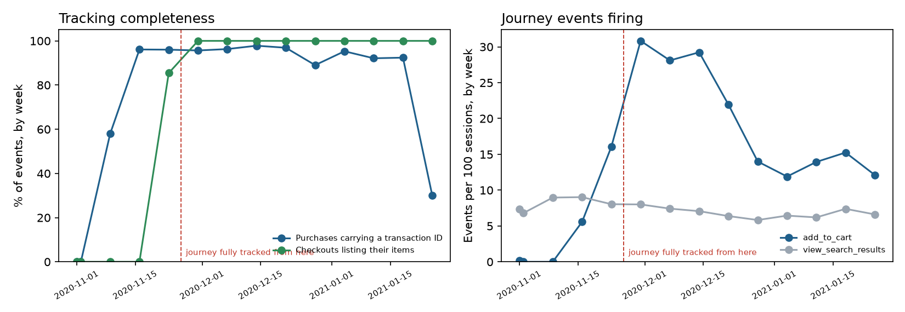
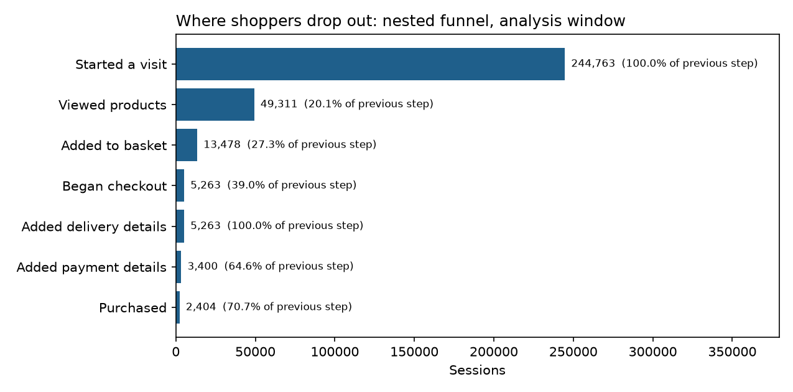
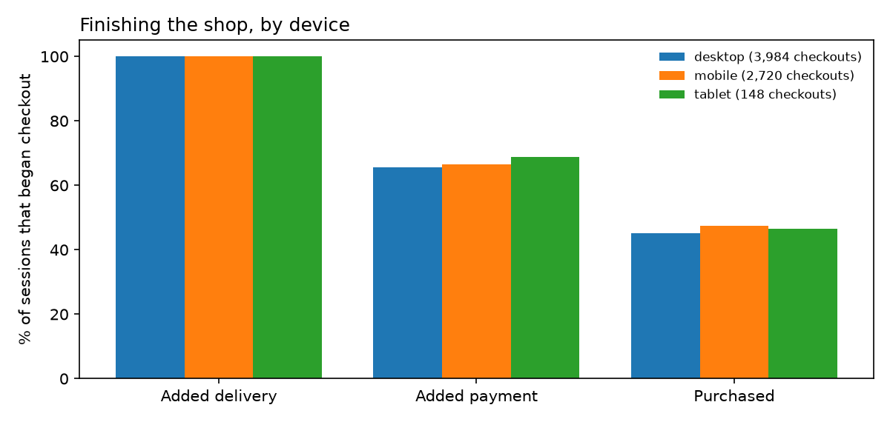
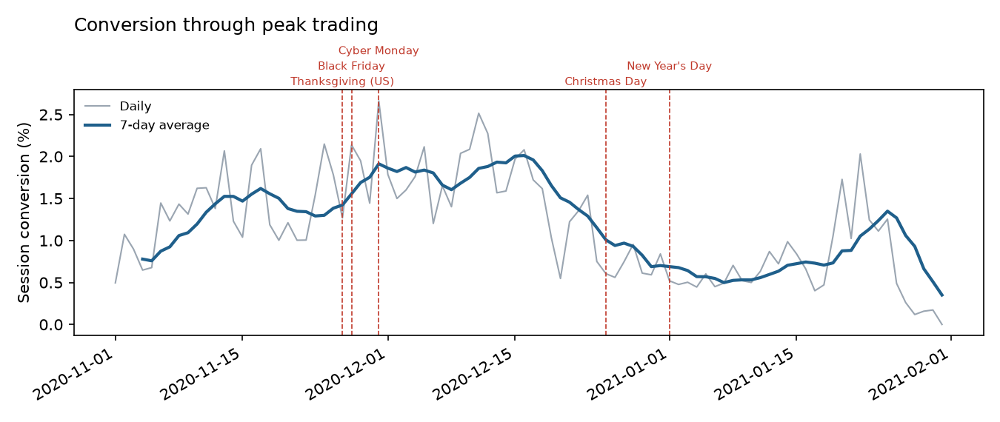

# Findings

_Generated by `python -m basketpath.build` from the real GA4 export. Every number is read from `marts/`; none is typed by hand._

## The data, and the part of it the journey analyses use

360,129 sessions from 270,154 users between 2020-11-01 and 2021-01-31 (4,295,584 events).

The journey analyses use **244,763 sessions** from 2020-11-26, the first day after which every journey event (product views, basket, checkout steps, purchase and search) fired at a normal rate every day, leaving out 2021-W04, which the data-quality gate held. Session conversion in that window is 1.29% (95% CI 1.25% to 1.34%).

## Counting orders

The export holds 5,692 purchase events. 320 repeat an order ID the same user had already sent, which is the confirmation page firing twice, and are removed. 450 carry neither an ID nor any revenue and are not counted as orders. That leaves **4,922 orders**, of which 456 have no ID: they carry revenue, so they are counted, but they cannot be checked for duplicates.

Counting raw purchase events instead would put session conversion in the analysis window at 1.35% rather than 1.29%.

## Whether the tracking can be trusted

The tracking audit ran 14 checks before any analysis, and 6 failed. In order of severity:
- **purchases missing transaction id** (high, owner: engineering): 906 of 5,692 (15.917%), above the limit of 0.5%.
- **duplicate purchase events** (high, owner: engineering): 320 of 5,692 (5.622%), above the limit of 0.2%.
- **purchases without revenue** (high, owner: engineering): 450 of 5,692 (7.906%), above the limit of 0.5%.
- **ecommerce events without items** (medium, owner: engineering): 150,960 of 489,060 (30.867%), above the limit of 1.0%.
- **add to cart with many products** (medium, owner: engineering): 56,158 of 58,543 (95.926%), above the limit of 5.0%.
- **tracking plan fields below target** (medium, owner: engineering): 4 of 15 (26.667%), above the limit of 0.0%.
- For information, **search terms obfuscated**: Google's obfuscation replaced every one of the 26,172 search terms, so the analysis uses whether people searched, not what they searched for.
- For information, **purchase revenue mismatch**: Of 5,242 purchase events that can be compared with their items, 721 differ by more than 1%: 362 worth more than their items and 359 less, by a median of 2.0%. Small gaps in both directions look like rounding or obfuscation noise. Missing delivery or tax charges would all push the same way, so this is not treated as a tracking fault.

Scorecard: `marts/audit_scorecard.csv`. Field coverage against the tracking plan: `marts/tracking_coverage.csv`. Day-by-day tracking: `marts/tracking_timeline.csv`.

## Where shoppers drop out

The largest proportional loss is from **started a visit** to **viewed products**: 20.1% of the 244,763 sessions at the first step reached the second.

| Step | Sessions | Share of all sessions | Share of previous step |
|---|---:|---:|---:|
| Started a visit | 244,763 | 100.00% | 100.0% |
| Viewed products | 49,311 | 20.15% | 20.1% |
| Added to basket | 13,478 | 5.51% | 27.3% |
| Began checkout | 5,263 | 2.15% | 39.0% |
| Added delivery details | 5,263 | 2.15% | 100.0% |
| Added payment details | 3,400 | 1.39% | 64.6% |
| Purchased | 2,404 | 0.98% | 70.7% |

Every one of the 5,263 sessions that began checkout also added delivery details. A real step always loses someone, so this event is probably sent automatically with the previous one, and the step separates no one.

The nested funnel ends at 2,404 sessions, but 3,158 sessions in the window ordered. The other 754 (23.9% of ordering sessions) are missing an earlier tracked step, such as an `add_to_cart` event, so they count towards conversion but not the funnel's last step.

Steps are nested: a session counts at a step only if it reached every earlier step. "Viewed products" means a `view_item` event, which in this export also fires on listing pages, so it measures seeing products rather than opening one product's page. Breakdowns by device, visitor type and channel: `marts/funnel.csv`.

## Search: does it help, or do people who search already intend to buy?

4.3% of sessions used site search. They converted at 4.03% against 1.17% for other sessions: a naive difference of +2.86 pp (95% CI +2.49 pp to +3.24 pp).

But searchers differ before they search. Compared like with like, within groups sharing the same device, new or returning status, channel and purchase history, the difference is +2.93 pp (95% CI +2.56 pp to +3.29 pp), covering 100.0% of search sessions. Differences in device, visitor type, channel and purchase history explain none of it: like for like, the gap is slightly larger.

A difference remains, but it may still reflect intent these groups do not capture, such as what the shopper came for. Observational data cannot separate the two; an experiment can.

Searching sessions saw products 47.3% of the time, against 18.9% for other sessions.

### The experiment that would settle it

Randomise **users**, not sessions, who search, between current search and a changed version. In the 3 sizing weeks (normal January trading, inside the analysis window), 1,126 users searched each week: 3.70% of them bought, and 42.94% saw products in a search session.

| Primary metric | Baseline | Smallest relative lift worth detecting | Users per arm | Weeks of search traffic |
|---|---:|---:|---:|---:|
| Bought within the week | 3.70% | 5% | 167,280 | 298 |
| Bought within the week | 3.70% | 10% | 42,798 | 77 |
| Bought within the week | 3.70% | 20% | 11,187 | 20 |
| Saw products in a search session | 42.94% | 5% | 8,392 | 15 |
| Saw products in a search session | 42.94% | 10% | 2,107 | 4 |
| Saw products in a search session | 42.94% | 20% | 530 | 1 |

At this traffic, detecting a 10% lift in buying would take 77 weeks, while the same lift in searchers seeing products would take 4. So the practical primary metric is seeing products after searching, the effect search can change directly, with buying and revenue per user as guardrails rather than the decision metric.

Two-sided tests at 5% with 80% power. Agree the smallest lift worth shipping before starting, and do not stop early on a promising result.

## Finishing the shop: checkout by device

Of sessions that began checkout, 47.4% completed on mobile against 45.2% on desktop (2,720 and 3,984 checkouts): a difference of +2.15 pp (95% CI -0.28 pp to +4.58 pp; within noise).

## Peak trading

| Window | Days used | Sessions a day | Conversion | Change vs baseline | Checkout completion | Revenue per order |
|---|---:|---:|---:|---:|---:|---:|
| Baseline: three weeks before Thanksgiving | 21 | 3,496 | 1.28% | baseline | n/a | $69.68 |
| Black Friday to Cyber Monday | 4 | 3,800 | 2.11% | +0.82 pp (p < 0.05) | 44.4% | $82.46 |
| Run-up to Christmas | 14 | 5,153 | 1.77% | +0.49 pp (p < 0.05) | 49.1% | $71.31 |
| Christmas to New Year | 9 | 2,859 | 0.69% | -0.59 pp (p < 0.05) | 53.0% | $64.48 |
| January | 21 (7 held) | 4,010 | 0.84% | -0.44 pp (p < 0.05) | 47.6% | $64.81 |

Conversion counts orders, which were tracked throughout, so every window is compared with the pre-Thanksgiving baseline, leaving out days in held weeks. Checkout completion appears only for windows inside the analysis window: before then checkout was not tracked the way it was later, so a comparison would measure the tracking change, not shoppers. In the baseline, 42.8% of orders have no transaction ID and cannot be checked for duplicates, so its revenue per order is less certain than later windows'.

## Custom segments

| Segment | Sessions | Share of sessions | Conversion | Revenue per session |
|---|---:|---:|---:|---:|
| All sessions | 244,763 | 100.0% | 1.29% | $0.99 |
| Searched | 10,624 | 4.3% | 4.03% | $3.43 |
| Did not search | 234,139 | 95.7% | 1.17% | $0.88 |
| Viewed products, added nothing | 35,833 | 14.6% | 1.82% | $1.27 |
| Abandoned basket | 11,084 | 4.5% | 0.00% | $0.00 |
| Abandoned checkout | 3,694 | 1.5% | 0.00% | $0.00 |
| New visitors on mobile | 72,469 | 29.6% | 0.70% | $0.46 |
| Returning previous buyers | 3,780 | 1.5% | 8.15% | $6.66 |
| Paid search visitors | 10,839 | 4.4% | 0.98% | $0.60 |

Each segment is a SQL rule on the session table, listed in `marts/segments.csv`, so it can be rebuilt in any analytics tool.

## What this data cannot tell us

- It is Google's obfuscated sample from its own merchandise store, not a grocer's site. Search terms and some other values are placeholders.
- The product lists inside `view_item` and `add_to_cart` events are not reliable here (see the audit), so the analysis works at session level, not product level.
- Everything here is observational: differences between groups describe who did what, not what caused it.
- Orders without transaction IDs are counted but cannot be de-duplicated.
